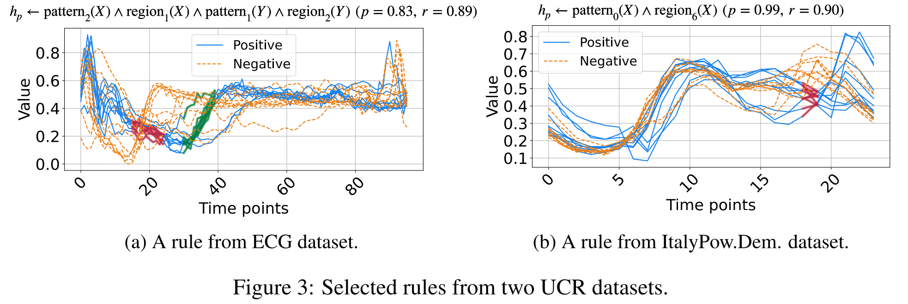

# This code implements the learning rules from raw sequence datasets.

The manuscript written by Kun Gao, Katsumi Inoue, Yognzhi Cao, Hanpin Wang, Feng Yang and accepted by ICLR 2025 can be found here:
https://openreview.net/pdf?id=zDjHOsSQxd

The means of parameter:
1. -t define the task. 'm' indicate running on UCR multi-variable data, 'b' indicate running on UCR binary variable data, 'd' indicate running on demo time series data, 'i' indicate running on image data, and 'abl_X' indicate running on ablation studies. Furthermore, 'abl_c' indicate the ablation studies on checking number of cluster parameter, 'abl_p' indicate the ablation studies on checking the number of period ,'abl_s' indicate the ablation studies on checking number of subsequence. 
2. Generally, the length of subsequence is less than the length of period. 

The following instructions for learning rules from raw data: 
1. Run on synthesis time series data
   py rule_learning_original/code/main.py -t d -d cuda:0

   Change archive_name = 'demo_sin' (line 1018) for running on sine data 
   Change archive_name = 'demo_threepatten' (line 1018) for running on triangle pulse data 

   Some experiments from demo time series data:
   

   Explanation: The highlighted parts consist of multiple subsequences and each subsequence locates in a period. 

2. Run on UCR time series data 
   py rule_learning_original/code/main.py -t b -d cuda:0
   
   change the focused_task = ['ECG200'] (line 1019) for run on ECG200 data

3. Run on image data 
   1. pre-generating trainable data by running 'data.py'
   setting the positive and negative labels as follows (lines 17-20):
   positive_label = [1]
   negative_label = [0]
   first_name = 'p1_'
   second_name = 'n0'
   py rule_learning_original/code/data.py
   2. run the learning rules
   py rule_learning_original/code/main.py -t i -d cuda:0

   change the append_info = ['p1_n0'] (line 1225) for learning rules describe the positive class 1 and negative class 0. 

4. Please annotate the watched hyperparameter variable when doing the ablation studies.

Please cite with this:
@inproceedings{NeurRL,
  author       = {Kun Gao and
                  Katsumi Inoue and
                  Yongzhi Cao and
                  Hanpin Wang and
                  Yang Feng},
  title        = {Differentiable Rule Induction from Raw Sequence Inputs},
  booktitle    = {The Thirteenth International Conference on Learning Representations,
                  {ICLR} 2025, Singapore, April 24-28, 2025},
  year         = {2025},
  url          = {https://openreview.net/forum?id=zDjHOsSQxd},
}

Appendix: 

When missing the software, please download and refer to the following version: 

  
Click to expand the software version table

| Package                  | Version       |
|--------------------------|---------------|
| python                   | 3.8.19         |
| absl-py                  | 1.4.0         |
| aiohttp                  | 3.9.5         |
| aiosignal                | 1.3.1         |
| array-record             | 0.4.0         |
| asttokens                | 2.4.1         |
| astunparse               | 1.6.3         |
| async-timeout            | 4.0.3         |
| attrs                    | 23.2.0        |
| backcall                 | 0.2.0         |
| blinker                  | 1.8.2         |
| Brotli                   | 1.1.0         |
| cached-property          | 1.5.2         |
| cachetools               | 5.3.3         |
| certifi                  | 2024.2.2      |
| cffi                     | 1.16.0        |
| charset-normalizer       | 3.3.2         |
| click                    | 8.1.7         |
| colorama                 | 0.4.6         |
| comm                     | 0.2.2         |
| contourpy                | 1.1.1         |
| cryptography             | 42.0.7        |
| cycler                   | 0.12.1        |
| debugpy                  | 1.8.1         |
| decorator                | 5.1.1         |
| dm-tree                  | 0.1.8         |
| dtaidistance             | 2.3.12        |
| et-xmlfile               | 1.1.0         |
| etils                    | 1.3.0         |
| executing                | 2.0.1         |
| filelock                 | 3.14.0        |
| flatbuffers              | 24.3.25       |
| fonttools                | 4.53.0        |
| frozenlist               | 1.4.1         |
| fsspec                   | 2024.6.0      |
| gast                     | 0.5.4         |
| google-auth              | 2.29.0        |
| google-auth-oauthlib     | 1.0.0         |
| google-pasta             | 0.2.0         |
| googleapis-common-protos | 1.63.1        |
| grpcio                   | 1.54.3        |
| h5py                     | 3.11.0        |
| idna                     | 3.7           |
| importlib_metadata       | 7.1.0         |
| importlib_resources      | 6.4.0         |
| ipykernel                | 6.29.4        |
| ipython                  | 8.12.3        |
| jedi                     | 0.19.1        |
| Jinja2                   | 3.1.4         |
| joblib                   | 1.4.2         |
| jupyter_client           | 8.6.2         |
| jupyter_core             | 5.7.2         |
| keras                    | 2.13.1        |
| kiwisolver               | 1.4.5         |
| llvmlite                 | 0.41.1        |
| Markdown                 | 3.6           |
| MarkupSafe               | 2.1.5         |
| matplotlib               | 3.7.5         |
| matplotlib-inline        | 0.1.7         |
| more-itertools           | 10.3.0        |
| mpmath                   | 1.3.0         |
| multidict                | 6.0.5         |
| nest-asyncio             | 1.6.0         |
| networkx                 | 3.1           |
| numba                    | 0.58.1        |
| numpy                    | 1.24.4        |
| nvidia-cublas-cu12       | 12.1.3.1      |
| nvidia-cuda-cupti-cu12   | 12.1.105      |
| nvidia-cuda-nvrtc-cu12   | 12.1.105      |
| nvidia-cuda-runtime-cu12 | 12.1.105      |
| nvidia-cudnn-cu12        | 8.9.2.26      |
| nvidia-cufft-cu12        | 11.0.2.54     |
| nvidia-curand-cu12       | 10.3.2.106    |
| nvidia-cusolver-cu12     | 11.4.5.107    |
| nvidia-cusparse-cu12     | 12.1.0.106    |
| nvidia-nccl-cu12         | 2.20.5        |
| nvidia-nvjitlink-cu12    | 12.5.40       |
| nvidia-nvtx-cu12         | 12.1.105      |
| oauthlib                 | 3.2.2         |
| openpyxl                 | 3.1.5         |
| opt-einsum               | 3.3.0         |
| packaging                | 24.0          |
| pandas                   | 2.0.3         |
| parso                    | 0.8.4         |
| pexpect                  | 4.9.0         |
| pickleshare              | 0.7.5         |
| pillow                   | 10.3.0        |
| pip                      | 24.0          |
| platformdirs             | 4.2.2         |
| promise                  | 2.3           |
| prompt_toolkit           | 3.0.47        |
| protobuf                 | 3.20.3        |
| psutil                   | 5.9.8         |
| ptyprocess               | 0.7.0         |
| pure-eval                | 0.2.2         |
| pyasn1                   | 0.6.0         |
| pyasn1_modules           | 0.4.0         |
| pycparser                | 2.22          |
| pyDatalog                | 0.17.4        |
| Pygments                 | 2.18.0        |
| PyJWT                    | 2.8.0         |
| pyOpenSSL                | 24.0.0        |
| pyparsing                | 3.1.2         |
| PySocks                  | 1.7.1         |
| python-dateutil          | 2.9.0.post0   |
| python-mnist             | 0.7           |
| pytz                     | 2024.1        |
| pyu2f                    | 0.1.5         |
| pyzmq                    | 26.0.3        |
| requests                 | 2.32.2        |
| requests-oauthlib        | 2.0.0         |
| rsa                      | 4.9           |
| scikit-learn             | 1.3.2         |
| scipy                    | 1.10.1        |
| seaborn                  | 0.13.2        |
| setuptools               | 69.5.1        |
| six                      | 1.16.0        |
| stack-data               | 0.6.3         |
| sympy                    | 1.12.1        |
| tensorboard              | 2.13.0        |
| tensorboard-data-server  | 0.7.0         |
| tensorflow               | 2.13.1        |
| tensorflow-datasets      | 4.9.2         |
| tensorflow-estimator     | 2.13.0        |
| tensorflow-metadata      | 1.14.0        |
| termcolor                | 2.4.0         |
| threadpoolctl            | 3.5.0         |
| toml                     | 0.10.2        |
| torch                    | 2.3.1         |
| torch-tb-profiler        | 0.4.3         |
| torcheval                | 0.0.7         |
| torchsummary             | 1.5.1         |
| torchvision              | 0.18.1        |
| tornado                  | 6.4.1         |
| tqdm                     | 4.66.4        |
| traitlets                | 5.14.3        |
| triton                   | 2.3.1         |
| tslearn                  | 0.6.3         |
| typing_extensions        | 4.12.2        |
| tzdata                   | 2024.1        |
| urllib3                  | 2.2.1         |
| utils                    | 1.0.2         |
| wcwidth                  | 0.2.13        |
| Werkzeug                 | 3.0.3         |
| wheel                    | 0.43.0        |
| wrapt                    | 1.16.0        |
| xgboost                  | 2.1.1         |
| yarl                     | 1.9.4         |
| zipp                     | 3.17.0        |

